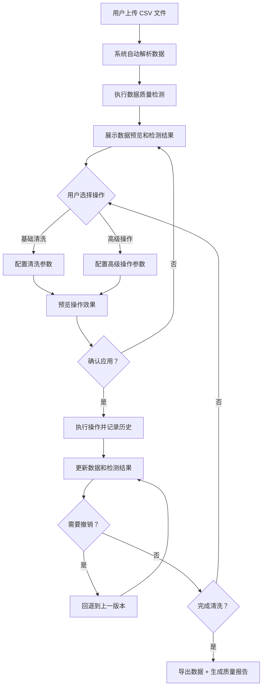

## 1. 产品概述

本地运行的 CSV 数据清洗工具，通过 Web 界面提供数据质量检测、一键清洗和高级数据操作功能，帮助数据分析人员快速完成数据预处理工作。

- 主要解决 CSV 数据导入后的脏数据问题（缺失值、异常值、重复行、格式不统一等）
- 目标用户为数据分析人员、数据工程师及需要处理表格数据的业务人员
- 产品价值：提供可视化、交互式的数据清洗体验，支持实时预览和操作撤销，无需编写代码即可完成复杂的数据预处理

## 2. 核心功能

### 2.1 功能模块

1. **文件上传模块**：支持 CSV 文件上传，自动解析并预览数据
2. **数据检测模块**：自动识别数据类型、检测缺失值、发现异常值和重复行
3. **一键清洗模块**：缺失值填充、删除重复行、修正数据类型、标准化日期格式、去除前后空格
4. **高级操作模块**：条件筛选批量替换、正则表达式提取、列拆分与合并、数据透视表生成
5. **操作管理模块**：实时预览效果、逐步撤销/重做操作
6. **导出报告模块**：导出为 CSV 或 Excel，生成数据质量报告

### 2.2 页面详情

| 页面名称 | 模块名称 | 功能描述 |
|-----------|-------------|---------------------|
| 主工作台 | 文件上传区 | 拖拽或点击上传 CSV 文件，显示文件基本信息 |
| 主工作台 | 数据预览表格 | 分页展示数据，支持列类型显示、行列统计 |
| 主工作台 | 数据检测面板 | 展示缺失值统计、异常值分布、重复行数量、数据类型分布 |
| 主工作台 | 基础清洗面板 | 缺失值填充（均值/中位数/众数/自定义）、去重、类型修正、日期标准化、去空格 |
| 主工作台 | 高级操作面板 | 条件筛选替换、正则提取、列拆分合并、透视表生成 |
| 主工作台 | 操作历史面板 | 操作时间线、逐步撤销/重做按钮 |
| 主工作台 | 导出报告区 | 导出 CSV/Excel、生成并查看数据质量报告 |

## 3. 核心流程

## 4. 用户界面设计

### 4.1 设计风格

- **主色调**：深蓝科技风（#1e3a5f 主色，#3b82f6 强调色），搭配深灰背景（#0f172a），营造专业数据分析工具氛围
- **辅助色**：数据状态色 - 绿色（#10b981 正常）、橙色（#f59e0b 警告）、红色（#ef4444 异常）
- **按钮风格**：圆角 6px，扁平化设计，hover 时有轻微阴影和颜色加深效果
- **字体**：显示字体使用 JetBrains Mono（等宽，数据展示更专业），正文字体使用系统无衬线字体
- **布局风格**：三栏布局（左侧操作面板 + 中间数据表格 + 右侧检测/历史面板），卡片式模块化设计
- **图标**：使用 lucide-react 线性图标，风格统一简洁

### 4.2 页面设计概述

| 页面名称 | 模块名称 | UI 元素 |
|-----------|-------------|-------------|
| 主工作台 | 文件上传区 | 大尺寸拖拽区域、虚线边框、上传图标、支持点击选择、文件上传进度条 |
| 主工作台 | 数据预览表格 | 固定表头、斑马纹、单元格悬停高亮、列类型标签、行号、分页控件 |
| 主工作台 | 数据检测面板 | 统计卡片（带图标和数值）、缺失值柱状图、异常值列表、重复行提示条 |
| 主工作台 | 基础清洗面板 | 分组折叠卡片、单选/多选控件、参数输入框、预览/应用按钮组 |
| 主工作台 | 高级操作面板 | Tab 切换（条件替换/正则提取/列操作/透视表）、表单配置区 |
| 主工作台 | 操作历史面板 | 时间线列表、操作描述、当前版本高亮、撤销/重做按钮 |
| 主工作台 | 导出报告区 | 导出格式选择、导出按钮、报告预览弹窗 |

### 4.3 响应式设计

- 桌面端优先（≥1280px）：三栏完整布局
- 中等屏幕（768-1279px）：左右面板可折叠，中间表格自适应
- 移动端（<768px）：单栏堆叠布局，面板通过抽屉式展开
