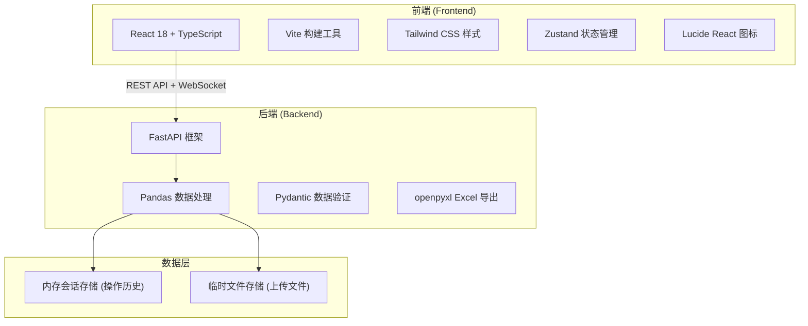
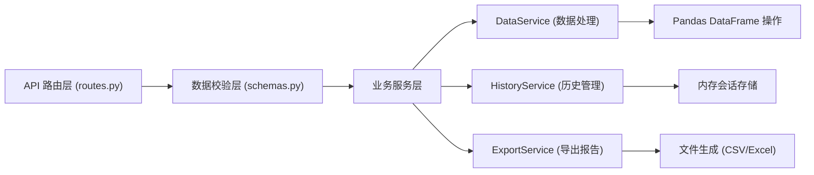

## 1. 架构设计



## 2. 技术描述

- **前端**：React 18 + TypeScript + Vite + Tailwind CSS 3 + Zustand
- **初始化工具**：Vite (react-ts 模板)
- **后端**：Python 3.9+ + FastAPI + Uvicorn
- **数据处理**：Pandas + NumPy + openpyxl
- **状态管理**：
  - 前端：Zustand（管理数据状态、操作历史、UI 状态）
  - 后端：内存会话存储（session_id 关联，保存操作历史栈）
- **通信协议**：REST API（JSON 格式），文件上传使用 multipart/form-data

## 3. 目录结构

```
1408/
├── backend/                    # Python 后端
│   ├── main.py                 # FastAPI 应用入口
│   ├── requirements.txt        # Python 依赖
│   ├── api/
│   │   ├── __init__.py
│   │   ├── routes.py           # API 路由定义
│   │   └── schemas.py          # Pydantic 请求/响应模型
│   ├── services/
│   │   ├── __init__.py
│   │   ├── data_service.py     # 数据解析、检测、清洗核心逻辑
│   │   ├── history_service.py  # 操作历史管理（撤销/重做）
│   │   └── export_service.py   # 导出和质量报告生成
│   └── utils/
│       ├── __init__.py
│       └── validators.py       # 数据校验工具函数
├── src/                        # React 前端
│   ├── main.tsx                # 应用入口
│   ├── App.tsx                 # 根组件
│   ├── index.css               # 全局样式
│   ├── store/
│   │   └── useDataStore.ts     # Zustand 状态管理
│   ├── components/
│   │   ├── FileUpload.tsx      # 文件上传组件
│   │   ├── DataTable.tsx       # 数据预览表格
│   │   ├── DetectionPanel.tsx  # 数据检测面板
│   │   ├── CleaningPanel.tsx   # 基础清洗面板
│   │   ├── AdvancedPanel.tsx   # 高级操作面板
│   │   ├── HistoryPanel.tsx    # 操作历史面板
│   │   └── ExportPanel.tsx     # 导出报告面板
│   ├── types/
│   │   └── index.ts            # TypeScript 类型定义
│   └── utils/
│       └── api.ts              # API 请求封装
├── public/
├── package.json
├── vite.config.ts
├── tsconfig.json
├── tailwind.config.js
└── postcss.config.js
```

## 4. API 定义

### 4.1 类型定义

```typescript
// 数据列信息
interface ColumnInfo {
  name: string;
  dtype: string;
  nullCount: number;
  nullPercentage: number;
  uniqueCount: number;
  sampleValues: any[];
  outliers: any[];
}

// 数据质量检测结果
interface DetectionResult {
  rowCount: number;
  columnCount: number;
  duplicateCount: number;
  totalNullCount: number;
  columns: ColumnInfo[];
  memoryUsage: string;
}

// 操作记录
interface HistoryEntry {
  id: string;
  operation: string;
  description: string;
  timestamp: number;
  params: Record<string, any>;
}

// 会话状态
interface SessionState {
  sessionId: string;
  filename: string;
  detection: DetectionResult | null;
  history: HistoryEntry[];
  currentStep: number;
}

// 清洗操作参数
interface FillNaParams {
  column: string;
  method: 'mean' | 'median' | 'mode' | 'custom';
  value?: any;
}

interface ReplaceParams {
  column: string;
  condition?: { op: string; value: any };
  oldValue?: any;
  newValue: any;
  regex?: boolean;
}

interface RegexExtractParams {
  column: string;
  pattern: string;
  newColumn: string;
}

interface SplitColumnParams {
  column: string;
  separator: string;
  newColumns: string[];
}

interface MergeColumnsParams {
  columns: string[];
  separator: string;
  newColumn: string;
}

interface PivotParams {
  index: string;
  columns: string;
  values: string;
  aggFunc: 'sum' | 'mean' | 'count' | 'min' | 'max';
}
```

### 4.2 端点列表

| 方法 | 路径 | 功能 | 请求体 | 响应 |
|------|------|------|--------|------|
| POST | /api/upload | 上传 CSV 文件 | multipart/form-data (file) | `{ sessionId, detection, preview }` |
| GET | /api/data/{sessionId} | 获取当前数据预览 | - | `{ data, columns, detection }` |
| GET | /api/data/{sessionId}/detect | 重新执行数据检测 | - | `DetectionResult` |
| POST | /api/clean/{sessionId}/fillna | 填充缺失值 | `FillNaParams` | `{ data, detection, historyEntry }` |
| POST | /api/clean/{sessionId}/drop_duplicates | 删除重复行 | `{ subset?: string[] }` | `{ data, detection, historyEntry }` |
| POST | /api/clean/{sessionId}/fix_dtypes | 修正数据类型 | `{ column: string; dtype: string }` | `{ data, detection, historyEntry }` |
| POST | /api/clean/{sessionId}/normalize_dates | 标准化日期格式 | `{ column: string; format?: string }` | `{ data, detection, historyEntry }` |
| POST | /api/clean/{sessionId}/strip_spaces | 去除前后空格 | `{ columns?: string[] }` | `{ data, detection, historyEntry }` |
| POST | /api/advanced/{sessionId}/replace | 条件筛选批量替换 | `ReplaceParams` | `{ data, detection, historyEntry }` |
| POST | /api/advanced/{sessionId}/regex_extract | 正则表达式提取 | `RegexExtractParams` | `{ data, detection, historyEntry }` |
| POST | /api/advanced/{sessionId}/split_column | 拆分列 | `SplitColumnParams` | `{ data, detection, historyEntry }` |
| POST | /api/advanced/{sessionId}/merge_columns | 合并列 | `MergeColumnsParams` | `{ data, detection, historyEntry }` |
| POST | /api/advanced/{sessionId}/pivot | 生成透视表 | `PivotParams` | `{ data, detection, historyEntry }` |
| POST | /api/history/{sessionId}/undo | 撤销上一步操作 | - | `{ data, detection, currentStep }` |
| POST | /api/history/{sessionId}/redo | 重做已撤销操作 | - | `{ data, detection, currentStep }` |
| GET | /api/export/{sessionId}/csv | 导出为 CSV | - | 文件流 |
| GET | /api/export/{sessionId}/excel | 导出为 Excel | - | 文件流 |
| GET | /api/export/{sessionId}/report | 生成数据质量报告 | - | `JSON 格式报告` |

## 5. 后端服务架构



### 核心服务职责：

- **DataService**：CSV 解析、数据类型推断、缺失值/异常值/重复行检测、各类清洗和高级数据操作
- **HistoryService**：维护每个会话的操作栈（撤销栈/重做栈），DataFrame 版本快照管理
- **ExportService**：将当前 DataFrame 导出为 CSV/Excel，汇总操作历史生成数据质量报告
